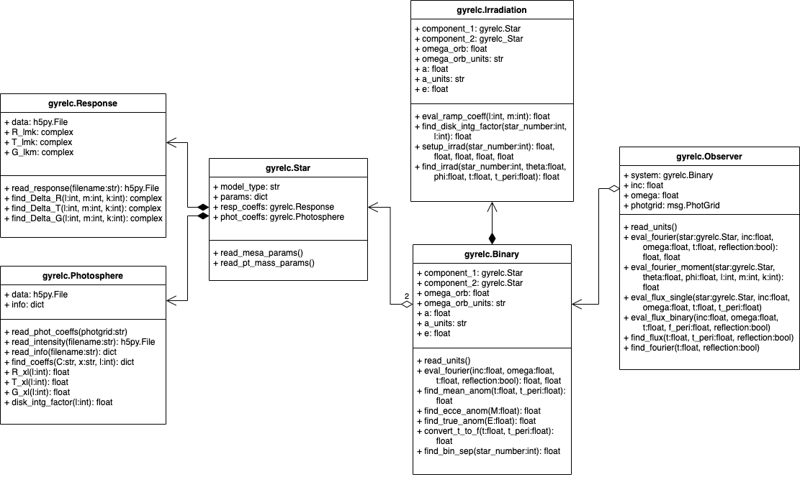

.. _understanding-gyre-lc:

.. gyre-lc documentation master file, created by

#############################
Understanding GYRE-lc
#############################

This chapter provides a deeper look into what the GYRE-lc package does and how it works.

**********************************
Tidally-induced Flux Variations
**********************************

GYRE-lc represents flux variations due to tides as a sum of intensity moments. It adopts the semi-analytical formalism for light variations described in :ads_citealt:`Townsend:2003b`, which applies to any stellar surface perturbation that can be written as a superposition of partial perturbations.

Accordingly, we can express perturbations to stellar radius :math:`R`, effective temperature :math:`T_\mathrm{eff}`, and surface gravity :math:`g_\eff` in the following terms:

.. math::
    \frac{\delta R}{R} (\theta, \phi; t) &= \mathrm{Re} \left[ \Delta_R Y_l^m(\theta, \phi) e^{\ii \sigma t} \right] \\
    \frac{\delta T_\eff }{T_\eff } (\theta, \phi; t) &= \mathrm{Re} \left[ \Delta_T Y_l^m(\theta, \phi) e^{\ii \sigma t} \right] \\
    \frac{\delta g_\eff}{g_\eff} (\theta, \phi; t) &= \mathrm{Re} \left[ \Delta_g Y_l^m(\theta, \phi) e^{\ii \sigma t} \right] 

Where :math:`\Yml (\theta, \phi)` are spherical harmonics and the perturbation coefficients are

.. math::
    \Delta_R &= \frac{\tilde{\xi}_r(R)}{R}\\
    \Delta_{T_\eff} &= \frac{1}{4} \left( \frac{\widetilde{\delta L}_\mathrm{rad}(R)}{L_\mathrm{rad}(R)} - 2 \frac{\tilde{\xi}_r(R)}{R} \right)\\
    \Delta_{g_\eff} &= (-\omega^2 - 2)\xi_{r_\mathrm{ref}}

and :math:`\omega &= -k\Omega_{orb} - m\Omega_{rot}` in the co-rotating frame.

Therefore, perturbations :math:`\delta \FF_{\lx}` to the stellar flux :math:`\FF_{\lx}` in some photometric passband :math:`x` can be expressed using the differential flux functions :math:`\{ \TT^m_{\lx}, \GG^m_{\lx}, \RR^m_{\lx} \}`, which depend on intensity moments :math:`\II_{\lx}`:

.. math::
   \frac{\delta \FF_{\lx}}{\FF_{\lx}} (\theta_o, \phi_o; t) &= \mathrm{Re} \left[ \left\{ \Delta_R \RR^m_{\lx}(\theta_o, \phi_o) + \Delta_T \TT^m_{\lx}(\theta_o, \phi_o) + \Delta_g \GG^m_{\lx}(\theta_o, \phi_o) \right\} e^{\ii \sigma t} \right] \\
   \RR^m_{\lx}(\theta_o,\phi_o) &\equiv \frac{(2+\ell)(1-\ell)}{\II_{0;x}} \II_{\lx} Y^m_l (\theta_o, \phi_o) \\
   \TT^m_{\lx}(\theta_o,\phi_o) &\equiv \frac{1}{\II_{0;x}} \frac{ \partial \II_{\lx}}{\partial \ln{ T_\eff}} Y^m_l (\theta_o, \phi_o) \\
   \GG^m_{\lx}(\theta_o,\phi_o) &\equiv\frac{1}{\II_{0;x}} \frac{ \partial \II_{\lx}}{\partial \ln{g}} Y^m_l (\theta_o, \phi_o). \\
   \II_{\lx} &= \int_0^1 \mu P_l(\mu)\II_x(\mu) d\mu

Here, :math:`\II_x(\mu)` is the specific intensity in passband :math:`x`, emergent from the stellar atmosphere at cosinus :math:`\mu` from the surface normal, and :math:`P_\ell(\mu)` is the Legendre polynomial of degree :math:`\ell`. The perturbation coefficients can be retrieved from the GYRE-tides output through algebra.

The photospheric data required to compute the specific intensities is provided by the spectral synthesis code for stars, MSG. A brief overview of its limitations and functionality follows.

*****
MSG
*****

*************
GYRE-tides
*************

.. GYRE-tides models forced oscillations of a star in a binary due to its companion's gravitational field :ads_citet:`Sun:2021`. As input for one such calculation, GYRE-tides takes a stellar model produced with `MESA <mesa.sourceforge.net>`_ and applies a forcing potential calculated via user-specified binary parameters (see :ref:`Preparing Your Inputs <python-walkthrough-inputs>`).

.. The forcing potential :math:`{\Phi_S}` can be written as an expansion of the gravitational potential at a point on the star's surface into spherical harmonics:

.. math:    
   \Phi_S (\vec{r}; t) &= \frac{-q G M}{|\vec{r} - \vec{r}_S|} \\
   &= \sum^\infty_{l=0} \sum^l_{m=-l} \sum^\infty_{k=-\infty} \Phi_{r;l,m,k}(r) \; Y^m_l(\theta, \phi) \; e^{-i k \Omega_\textrm{orb} t}

.. Here, :math:`{\Phi_{r;l,m,k}}` is the radial component of the forcing potential amplitude, and :math:`{Y^m_l}` is the spherical harmonic of order $m$ and degree $l$.  

The exponential term is the $k$-th Fourier harmonic. Restricting ourselves to small amplitude tides allows us to write the response perturbation as a superposition of many different partial tides:

.. math::
   \xi_r(\vec{r}; t) = \sum_{l,m,k} \tilde{\xi}_{r; l,m,k}(r) \; Y^m_l (\theta, \phi) \; e^{-i k \Omega_\textrm{orb} t}

It follows from :ads_citet:`Townsend:2003b` (see :ref:`The Semi-analytical Formalism <understanding-formalism>`) that we may also expand the radiative luminosity that way into surface luminosity variations:

.. math::
   \delta L(\vec{r};t)_\textrm{rad} = \widetilde{\delta L}_{\textrm{rad};l,m,k}(r) \; Y^m_l \; e^{-i k \Omega_\textrm{orb} t }

.. It behooves us to probe the practical limitations of this approach. The net tidal force can be characterized by the tidal strength term

.. math
   \epsilon_\mathrm{T} \equiv \left( \frac{R}{a} \right)^3 = \frac{R^3 \Omega_\textrm{orb}^2}{GM}\times \left( \frac{q}{1+q} \right).

.. For small amplitude tides, :math:`\epsilon_\mathrm{T} << 1`.

.. For wide binaries, this assertion easily holds as long as the primary's radius :math:`R` is much smaller than the semimajor axis :math:`a`. For some highly eccentric binaries on the other hand, such as eccentric ellipsoidal variables, a small mass ratio :math:`q=M_2/M` between the secondary and primary stars might be a good enough diagnostic.  We will probe the edge of where our 'weak tides' approach breaks down in a future work.

GYRE-tides calculates the tide model, i.e. the partial tide amplitudes :math:`\tilde{\xi}_{r;l,m,k}(R)` and surface luminosity variations :math:`\widetilde{\delta L}_{\textrm{rad};l,m,k}(R)`, and writes them to file. A corresponding tide model is then created for the companion's neighbor. Both tide models, along with their corresponding stellar models, are the 4 files required to build a single light curve using GYRE-LC.

******
MSG
******

***************
Irradiation
***************

***************
Architecture
***************
Fig. 1 shows a class diagram representation of GYRE-lc's architecture, omitting some technical details like most private methods and attributes. 

   Figure 1. GYRE-lc's architecture is roughly meant to imply a "zooming out" from the photosphere all the way out to the observer.

.. note:: This project is under active development.

.. rubric:: Footnote
